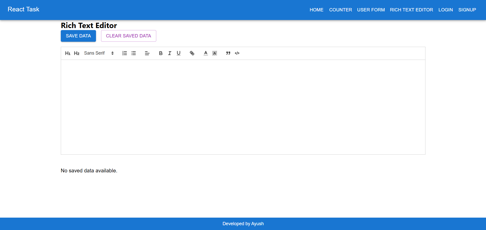
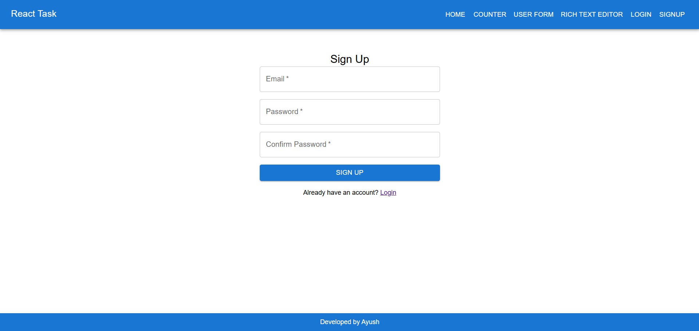
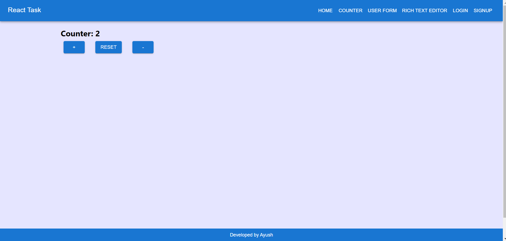
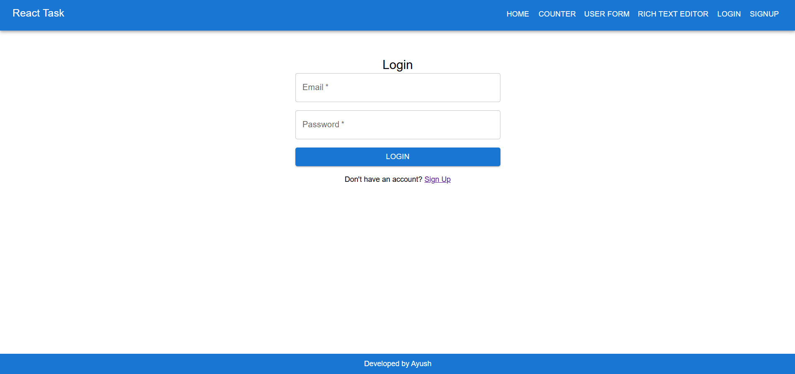
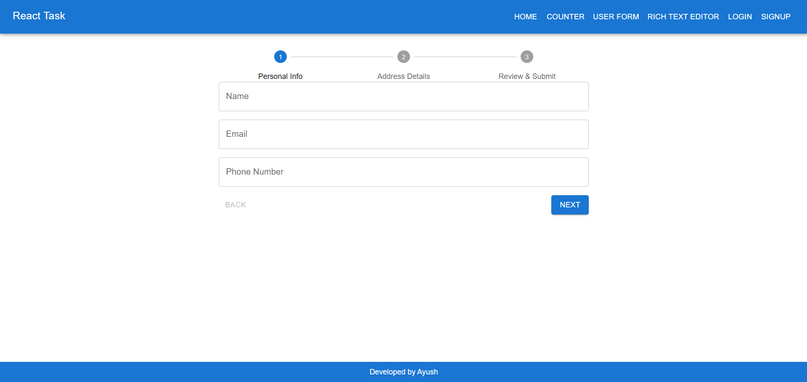

Overview
This is a React project built using Material-UI, featuring multiple functional components that enhance user interactivity. The project incorporates various third-party libraries to provide a seamless user experience.

Key Components Included
✔️ Counter Component - A simple increment and decrement counter.
✔️ User Form - A form with validation using Formik and Yup.
✔️ Text Editor - A rich text editor implemented using React-Quill.
✔️ Authentication Pages - Static login and signup pages.

This project demonstrates the use of modern React.js practices, UI styling with Material-UI, form handling with Formik & Yup, and text editing functionality with React-Quill.

Home Page: Includes a counter component, user form, and text editor.

Counter Component: Basic increment and decrement functionality.

User Form: Form validation with Formik and Yup.

Text Editor: Implemented using React-Quill.

Authentication Pages: Static login and signup pages.

 Technologies Used
The project utilizes the following technologies:

React.js - A JavaScript library for building user interfaces.
Material-UI - A React-based UI component library for styling and layout.
React-Quill - A rich text editor for content creation.
Formik - A library for form handling and validation.
Yup - A schema builder for form validation.
React-Router-Dom - A library for handling navigation and routing in a React application.

## Screenshots

### 1️⃣ React Text Editor

### 2️⃣ Signup Page

### 3️⃣ Counter Component

### 4️⃣ Login Page

### 5️⃣ Task Screenshot

Installation & Setup

Clone the repository

git clone https://github.com/Ayushsaxen/React-Task.git
cd React-Task

Install dependencies

npm install

Run the project

npm start

License
This project is open-source and free to use. Feel free to modify and contribute!

